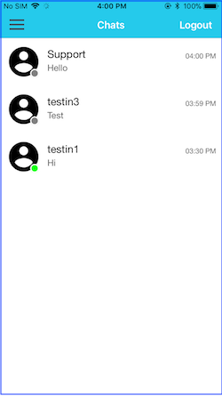

# MessagingApp
Sample chat application with XMPP and NoChat frameworks

 

## Pre-requisites
* Xcode 10.0 or higher
* Cocoapods

## Install and run

* clone the repo to your computer
* Go to `MessagingApp` folder in terminal and run `pod install` command
* Once all the dependencies are downloaded, open the `.xcworkspace` file

## Features
* Login
* Shows the list of friends.Showing the presence of the friends online/offline with green/gray dot over profile pic and recent message with time
* Can send text message to a friend
* Has message history for each of the friends
* Logout

## Limitations
* The application connects the XMPP server at `im.koderoot.net`
* All the accounts are registered at [koderoot](https://www.koderoot.net/) XMPPA server
* If we can set avatar in server then that will display in application also(Wrote the code to display it). If not default profile pictures are displaying.
* Registration of a new account can be done [here](https://im.koderoot.net/register-on-im.koderoot.net)
* No avatar information is got

## Data Maintainance
* Coredata (for storing the chat and user information)

## Attributions
The following libraries were used for developing the application
* XMPP Framework
* NoChat (for chat UI)

## Test accounts
There are currently 3 test accounts in use
* testin1
* testin2
* testin3
All the accounts have the same password `testin123`
